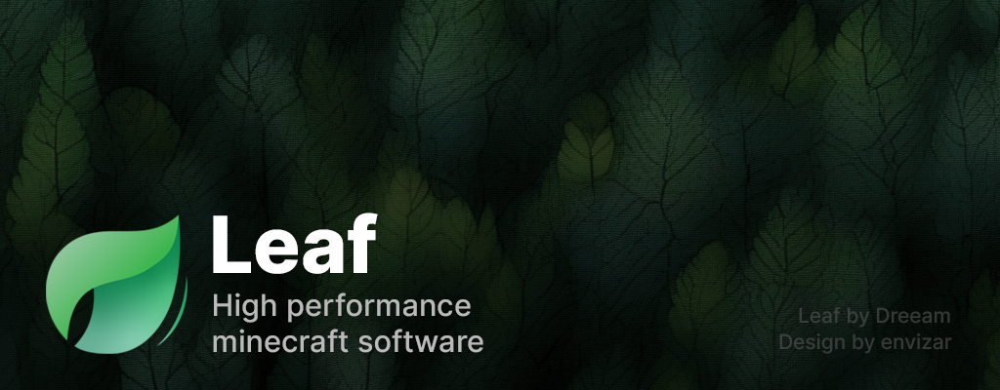

<div align="center">

[](https://gitlab.com/vospek/minecraft-dev/leviathan/-/releases)⠀
[](https://gitlab.com/vospek/minecraft-dev/leviathan/-/pipelines)

**Leviathan** is a [Paper](https://papermc.io/) fork designed to be customizable and high-performance, forked from [Leaf](https://github.com/Winds-Studio/Leaf).
</div>

> [!WARNING]
> Leviathan is a performance-oriented fork. Make sure to take backups **before** switching to it. Everyone is welcome to contribute optimizations or report issues to help us improve.

**English** | [中文](public/readme/README_CN.md)

## 🐋 Features
- **Based on [Paper](https://papermc.io/)** for generic performance and flexible API
- **Async** pathfinding, mob spawning and entity tracker
- **Various optimizations** blending from [other forks](#-credits) and our own
- **Fully compatible** with Spigot and Paper plugins
- **Latest dependencies**, keeping all dependencies up-to-date
- **Allows all characters in usernames**, including Chinese and other characters
- **Fixes** some Minecraft bugs
- **Mod Protocols** support
- **More customized** relying on features of [Purpur](https://github.com/PurpurMC/Purpur)
- **Linear region file format**, to save disk space
- **Maintenance friendly**, integrating with [Sentry](https://sentry.io/welcome/) of [Pufferfish](https://github.com/pufferfish-gg/Pufferfish) to easily track all errors coming from your server in extreme detail
- And more...

## 📥 Download
Download Leviathan from [GitLab Releases](https://gitlab.com/vospek/minecraft-dev/leviathan/-/releases)

## 📦 Building
Building a Paperclip JAR for distribution:
```bash
./gradlew applyAllPatches && ./gradlew createPaperclipJar
```

## 📦 API
<details>
<summary>Click to expand</summary>

The Leviathan API is published to the [GitLab Package Registry](https://gitlab.com/vospek/minecraft-dev/leviathan/-/packages) by the CI pipeline.

### Gradle
```kotlin
repositories {
  maven {
    url = uri("https://gitlab.com/api/v4/projects/vospek%2Fminecraft-dev%2Fleviathan/packages/maven")
    credentials(HttpHeaderCredentials::class) {
      name = "Private-Token"
      value = System.getenv("GITLAB_TOKEN")
    }
  }
}

dependencies {
    compileOnly("dev.vospek.leviathan:leviathan-api:26.2.local-SNAPSHOT")
}

java {
  toolchain.languageVersion.set(JavaLanguageVersion.of(25))
}
```

### Maven
```xml
<repository>
    <id>gitlab</id>
    <url>https://gitlab.com/api/v4/projects/vospek%2Fminecraft-dev%2Fleviathan/packages/maven</url>
</repository>
```
```xml
<dependency>
    <groupId>dev.vospek.leviathan</groupId>
    <artifactId>leviathan-api</artifactId>
    <version>26.2.local-SNAPSHOT</version>
    <scope>provided</scope>
</dependency>
```
</details>

## 📊 bStats
Leviathan uses [bStats](https://bstats.org) to collect anonymous usage statistics, such as how many servers run Leviathan and which Minecraft versions are in use. You can opt out by setting `enabled: false` in `plugins/bStats/config.yml`.

[View Leviathan on bStats](https://bstats.org/plugin/server-implementation/Leviathan)

## ⚖️ License
Leviathan is licensed under various open source licenses from its upstream projects. See [LICENSE.md](LICENSE.md) for full details.

## 📜 Credits
Thanks to these projects below. Leviathan includes some patches taken from them.<br>
If these excellent projects hadn't existed, Leviathan wouldn't have become great.

- [Leaf](https://github.com/Winds-Studio/Leaf) (the fork this project is based on)
- [Gale](https://github.com/Dreeam-qwq/Gale) ([Original Repo](https://github.com/GaleMC/Gale))
- [Pufferfish](https://github.com/pufferfish-gg/Pufferfish)
- [Purpur](https://github.com/PurpurMC/Purpur)
- <details>
    <summary>🍴 Expand to see forks that Leviathan takes patches from.</summary>
    <p>
      • <a href="https://github.com/KeYiMC/KeYi">KeYi</a> (R.I.P.)
        <a href="https://github.com/MikuMC/KeYiBackup">(Backup)</a><br>
      • <a href="https://github.com/etil2jz/Mirai">Mirai</a><br>
      • <a href="https://github.com/Bloom-host/Petal">Petal</a><br>
      • <a href="https://github.com/fxmorin/carpet-fixes">Carpet Fixes</a><br>
      • <a href="https://github.com/Akarin-project/Akarin">Akarin</a><br>
      • <a href="https://github.com/Cryptite/Slice">Slice</a><br>
      • <a href="https://github.com/ProjectEdenGG/Parchment">Parchment</a><br>
      • <a href="https://github.com/LeavesMC/Leaves">Leaves</a><br>
      • <a href="https://github.com/KaiijuMC/Kaiiju">Kaiiju</a><br>
      • <a href="https://github.com/PlazmaMC/PlazmaBukkit">Plazma</a><br>
      • <a href="https://github.com/SparklyPower/SparklyPaper">SparklyPaper</a><br>
      • <a href="https://github.com/HaHaWTH/Polpot">Polpot</a><br>
      • <a href="https://github.com/plasmoapp/matter">Matter</a><br>
      • <a href="https://github.com/LuminolMC/Luminol">Luminol</a><br>
      • <a href="https://github.com/Gensokyo-Reimagined/Nitori">Nitori</a><br>
      • <a href="https://github.com/Tuinity/Moonrise">Moonrise</a> (during 1.21.1)<br> 
      • <a href="https://github.com/Samsuik/Sakura">Sakura</a><br> 
    </p>
</details>

## 🔥 Special Thanks

<table>
  <tr>
    <td colspan="2" align="center">
      <a href="https://www.yourkit.com/">
        
      </a>
      <p>YourKit supports open source projects with innovative and intelligent tools for monitoring and profiling Java and .NET applications. YourKit is the creator of <a href="https://www.yourkit.com/java/profiler/">YourKit Java Profiler</a>, <a href="https://www.yourkit.com/dotnet-profiler/">YourKit .NET Profiler</a>, and <a href="https://www.yourkit.com/youmonitor/">YourKit YouMonitor</a>.</p>
    </td>
  </tr>
</table>